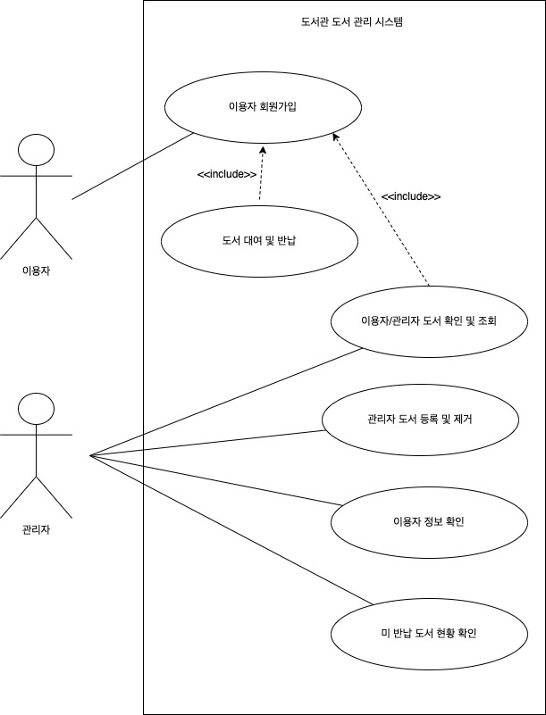
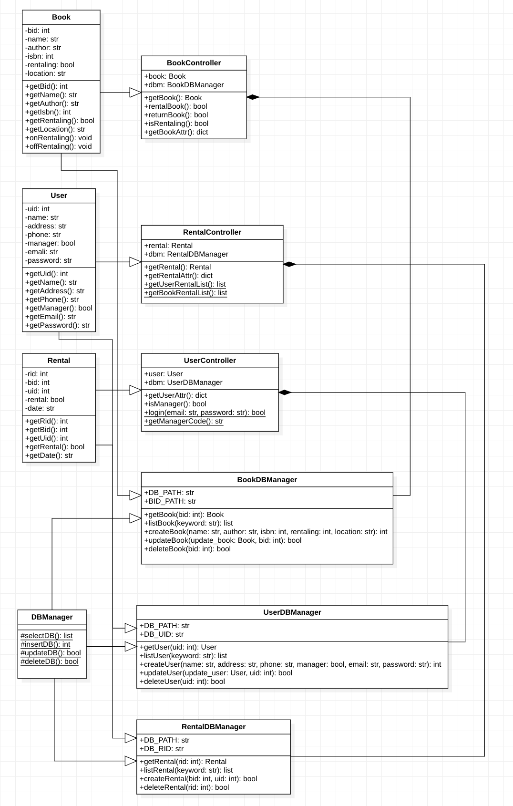
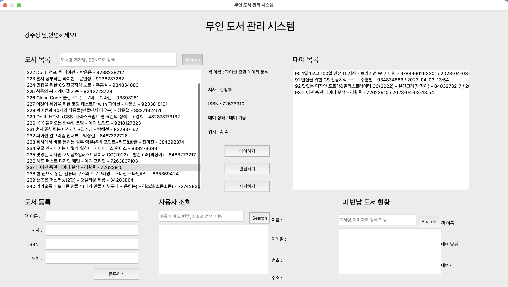

# 무인 도서 관리 

## System Description
  
1. Description

    - 분석 설계 대상 시스템 명 : 무인 도서 관리 시스템
    - 도서 등록/제거 : 도서관 관리자가 새로운 도서가 도서관에 들어왔을 때 도서명, 저자, 도서고유번호를 시스템에 입력하여 새로운 도서를 추가하거나 해당 도서를 제거하는데 사용됩니다.
    - 도서 조회 : 도서관 관리자 또는 도서관 이용자가 도서명, 저자, 도서고유번호를 통해 도서관에 해당 도서가 존재하는지와 어느 위치에 보관되어 있는지, 현재 대 여중인지 확인할 때 사용됩니다.
    - 도서 대여/반납 : 도서관 이용자가 시스템에 도서고유번호를 입력하여 도서를 대여 또는 반납할 때 사용됩니다.
    - 미 반납 도서 확인 : 미 반납 되어있는 도서들만 조회하여 대여자 정보를 한눈에 확 인할 때 사용됩니다.
    - 도서관 이용자 등록 : 도서관에서 도서 대여/반납 서비스를 이용할 도서관 이용자 가 본인의 정보를 등록할 때 사용됩니다.

2. Vision

    - 도서관에 도서관 관리자는 수많은 도서들을 관리해야 하는데 그때 관리 시스템을 통하여 도서관에 도서 미 반납 현황, 도서 보유 현황을 한번에 확인할 수 있고, 도서관 이용자는 언제든 편리하게 도서 반납 및 대여를 할 수 있는 무인 도서 대여, 반납 서비스를 이용할 수 있습니다.

3. Scope
    - 도서 조회, 대여/반납 서비스를 이용하는 도서관 이용자
    - 도서 등록/제거, 미 반납 도서 확인 서비스를 이용하는 도서관 관리자

## Requirement & Scenario

1. Functional Requirements

    |번호|내용|
    |---|---|
    |FR1|관리자 모드와 이용자 모드를 선택할 수 있는 버튼이 있다.|
    |FR2|관리자 모드에 접속하기 위해 관리자 비밀번호를 입력합니다. 비밀번호가 유효하지 않으면 비밀번호가 유 효하지 않다는 팝업 메시지를 보여 준다.|
    |FR3|관리자 모드와 이용자 모드에서 도서 데이터 목록을 볼 수 있는 라벨이 있다.|
    |FR4|관리자 모드에서 이용자 데이터 목록을 볼 수 있는 라벨이 있다.|
    |FR5|관리자 모드에서 미 반납 현황 버튼을 클릭하면 미 반납 도서와 해당 도서를 대여한 이용자 목록을 볼 수 있는 라벨이 있다.|
    |FR6|관리자 모드에서 도서 등록 버튼을 클릭하면 도서 등록 양식이 보이고 도서를 등록할 수 있다.|
    |FR7|관리자 모드에서 도서 목록에 있는 도서를 선택하고 제거 버튼을 클릭하면 기존 도서를 제거할 수 있다.|
    |FR8|관리자 모드와 이용자 모드에서 검색창에 도서명, 저자, 도서고유번호를 입력하고 검색을 클릭하면 해당 도서 데이터를 볼 수 있다.|
    |FR9|이용자 모드를 선택하면 이용자 번호와 이름을 입력하여 이용자 모드로 접근할 수 있다.|
    |FR10|이용자 모드를 선택하고 이용자 등록 버튼을 클릭하면 이용자의 상세정보를 입력하고 이용자를 등록할 수 있다.|
    |FR11|이용자 모드에서 도서 목록에 있는 도서를 선택하고 대여 버튼을 클릭하면 해당 도서는 대여 상태로 변경 된다.|
    |FR12|이용자 모드에서 대여 목록 버튼을 클릭하면 내가 대여한 도서 목록을 볼 수 있고 대여 목록에서 반납할 도서를 선택하여 반납 버튼을 클릭하면 해당 도서는 반납 상태가 된다.|

2. Non-functional Requirements

    |번호|내용|Quality|
    |---|---|-------|
    |NFR1|관리자 모드로 접속하기 위해서는 관리자 비밀번호가 유효해야 한다.|Security|
    |NFR2|관리자와 이용자는 간단한 GUI를 통해 쉽게 접근할 수 있다.|Usability|
    |NFR3|도서 데이터는 파일 입/출력을 통해 로컬에서 저장하고 수정된다.|Security|
    |NFR4|이용자 모드는 등록된 이용자만 이용할 수 있다.|Security|
    |NFR5|도서 등록/제거는 관리자 모드에서만 가능하다.|
    |NFR6|이용자 현황은 관리자 모드에서만 접근 가능하다.|

3. Scenario

    |번호|시나리오|자세한 시나리오 내용|
    |---|------|---------------|
    |FR1, FR2, FR9 NFR1, NFR4|모드 선택|이용자 모드와 관리자 모드를 선택할 수 있고 도서관 이용자가 이용자 모드 를 선택하면 회원번호를 통해 접속할 수 있고 회원번호가 존재하지 않으면 이용자 모드로 접속할 수 없다. 관리자 모드를 선택하면 관리자 비밀번호를 입력해야 하고 비밀번호가 유효하지 않으면 관리자 모드로 접속할 수 없다.|
    |FR10|이용자 등록|이용자 등록 버튼을 클릭하면 이용자의 이름, 생년월일, 주소, 전화번호를 입력하고 등록을 누르면 회원고유번호가 발급된다.|
    |FR6, FR7 NFR5|도서 등록/제거|새로운 도서가 도서관에 들어오면 관리자 모드로 접속하여 도서 등록 버튼 을 클릭하고 도서 정보를 입력하고 등록한다. 도서관에 존재하지 않는 도서 는 도서 목록에서 제거할 도서를 선택 후 제거 버튼을 클릭하여 해당 도서 데이터를 제거한다.|
    |FR3, FR8|도서 목록/검색|시스템에 접속하면 도서 목록이 보이고 바로 위에 있는 검색창에 도서명, 저자, 도서고유번호 등을 입력하여 해당 키워드를 통해 도서 목록을 필터링 할 수 있다.|
    |FR4 NFR6|이용자 목록|관리자 모드로 접속하여 이용자 현황 버튼을 클릭하면 현재 시스템에 등록 되어 있는 이용자 목록과 상세정보를 볼 수 있으며 현재 대여중인 도서 정 보도 추가적으로 볼 수 있다.|
    |FR5|미 반납 현황 확인|관리자 모드를 접속하여 미 반납 도서 현황 버튼을 클릭하면 현재 대여중인 도서 목록과 대여자에 대한 정보를 볼 수 있다.|
    |FR11, FR12|도서 대여/반납|이용자 모드로 접속하여 도서 목록에서 원하는 도서를 선택하고 대여 버튼 을 클릭하면 해당 도서는 대여 상태로 변경되고 대여 도서중인 도서 버튼을 클릭하면 내가 대여중인 도서 목록이 보이고 반납을 원하는 도서를 선택하 고 반납 버튼을 클릭하면 해당 도서가 반납 상태로 변경된다.|

## Use Case

1. Use Case Description

    UC1. 이용자 회원가입하기

    |항목|내용|
    |---|---|
    |Use case name|이용자 회원가입하기|
    |scenario|도서관 이용자가 시스템을 통해 회원가입을 한다.|
    |Triggering event|이용자는 시스템에 접속 하기를 원한다.
    |Brief description|이용자는 시스템을 접근하기 위해 회원가입을 하고 회원번호를 발급 받아야 한다. 이름, 생년월일, 주소, 전화번호를 입력하고 완료 버튼을 클릭 한다. 회원가입이 정상적으로 완료 되었으면 회원번호가 최초로 한번 출력된다. 회원번호는 이용자가 시스템에 접근할 때 필요한 정보다.
    |Actors|도서관 이용자
    |Related use cases|이용자 등록
    |Stakeholders|관리자, 이용자
    |Preconditions|회원가입 입력 창을 출력한다.
    |Post conditions|회원가입이 정상적으로 완료 되었으면 회원번호를 출력한다.
    |Flow of activities|Actor : 1. 이용자는 회원가입을 위해 회원가입 버튼을 클릭한다. 2. 이름, 전화번호, 주소, 생년월일을 입력 한다. 3. 입력을 마치면 완료 버튼을 클릭 한다. 4. 출력된 회원번호를 이용자가 저장한다. System : 3.1. 완료 버튼이 클릭 되었을 때, 입력된 정보에서 전화번호를 통해 현재 가입되어 있는 유저 정보의 전화번호와 비교하여 같은 전화번호가 존재하면 이미 가입된 유저라는 팝업창을 출력한다. 3.2. 존재하지 않는 전화번호라면 입력된 정보를 저장하고 회원가입 성공 팝업창을 출력한다.
    |Exception conditions|1. 회원가입 시 이미 가입 되어있는 이용자일 경우 -> 회원가입 시 입력된 전화번호를 통해 이미 가입되어 있다는 팝업창을 보여준다. 2. 회원가입 입력 양식에 빈칸이 존재하는 경우 -> 빈칸이 존재하면 안된다는 팝업창을 보여준다.

    UC2. 이용자/관리자 도서 확인 및 조회하기

    |항목|내용|
    |---|---|
    |Use case name|도서 목록 확인 및 조회하기
    |scenario|이용자 및 관리자가 도서 목록을 확인하고 검색한다.
    |Triggering event|관리자/이용자는 도서관 내 도서 목록을 확인하고 조회하길 원한다.
    |Brief description|관리자/이용자는 시스템에 접속하여 현재 도서관에서 가지고 있는 도서 목록을 확인하고 검색창 에 도서명 또는 저자명을 입력하여 원하는 도서가 있는지와 대여 가능 여부를 확인하고 도서관 어 느 곳에 도서가 있는지 확인할 수 있다.
    |Actors|관리자/이용자
    |Related use cases|도서관 도서 목록 확인, 도서 검색
    |Stakeholders|관리자/이용자
    |Preconditions|관리자/이용자는 시스템에 등록되어 있는 유저여야 한다.
    |Post conditions|시스템에 접속하면 도서 목록이 출력되고 검색창을 통해 검색 가능하다.
    |Flow of activities| Actor : 1. 시스템에 로그인한다. 2. 도서 목록을 통해 도서 데이터를 확인한다. 3. 검색을 통해 필요한 도서를 찾는다. System : 3.1. 검색창에 입력된 단어를 통해 저장된 도서 데이 터에서 도서명과 저자를 필터링한다. 3.2. 필터링된 도서 데이터를 시스템 도서 목록에 출 한다.
    |Exception conditions|1. 도서 검색 시 존재하지 않는 도서일 경우 -> 해당 도서가 존재하지 않습니다. 라는 문구를 팝업창으로 출력해준다.

    UC3. 관리자 도서 등록 및 제거하기

    |항목|내용|
    |---|---|
    |Use case name|관리자 도서 등록 및 제거하기
    |scenario|관리자가 도서를 등록하거나 제거한다.
    |Triggering event|관리자가 도서관에 새로 들어온 도서를 등록하거나 도서관에 없는 도서를 제거하려고 한다.
    |Brief description|관리자가 시스템 메인 화면에서 도서 등록 버튼을 클릭하면 도서명, 저자, 도서 고유 번호, 도서 위 치를 입력할 수 있는 화면이 출력된다. 해당 포맷에 맞게 정보를 입력하고 도서 등록하기 버튼을 클릭하면 도서 목록에 새로 등록한 도서가 추가된다. 도서관에 기존에 등록되어 있던 도서가 제거 되면 도서 목록에서 해당 도서를 선택한 후 도서 제거 버튼을 클릭하여 시스템에서 해당 도서 뎅터 를 제거 할 수 있다.
    |Actors|관리자
    |Related use cases|도서 등록하기, 도서 제거하기
    |Stakeholders|관리자
    |Preconditions|도서 등록 및 제거 버튼은 관리자로 시스템에 접속한 유저만 사용 가능하다.
    |Post conditions|관리자로 접속하면 도서 등록 및 제거 버튼이 활성화 된다.
    |Flow of activities|Actor : 1. 관리자 모드로 시스템에 접속한다. 2. 도서 등록하기 버튼을 클릭한다. 3. 새로운 도서 정보를 양식에 맞춰 입력하고 등록하기 버튼을 클릭한다. 4. 제거하려는 도서를 검색한다. 5. 도서 목록에서 원하는 도서를 선택하고 제거하기 버튼을 클릭한다. System : 2.1. 도서 정보를 입력할 수 있는 화면을 출력한다. 3.1. 입력된 도서 정보를 저장한다. 4.1. 검색 된 도서 목록을 출력한다.5.1. 해당 도서 데이터를 시스템에서 제거한다.
    |Exception conditions| 1. 도서 등록 시 빈칸이 있을 때 -> 빈칸을 모두 입력해주세요. 라는 팝업창을 출력해준다. 2. 도서 등록 시 이미 존재하는 도서가 있을 때 -> 해당 도서가 이미 존재합니다. 라는 팝업창을 출력해준다. 3. 제거하려는 도서가 이미 시스템 내 데이터에 존재하지 않을 때 -> 존재하지 않는 도서 입니다. 라는 팝업창을 출력해주고 도서 목록을 새로고침 해준다. 4. 관리자가 아닌 이용자가 도서 등록 및 제거 버튼을 클릭한다. -> 등록 및 제거 버튼을 클릭 했을 때 관리자 권한이 없습니다. 라는 팝업창을 출력한다.

    UC4. 이용자 도서 대여 및 반납하기

    |항목|내용|
    |---|---|
    |Use case name|이용자 도서 대여 및 반납하기
    |scenario|이용자가 도서를 대여하거나 반납한다.
    |Triggering event|이용자가 도서관 내에 있는 도서를 대여하거나 반납 하기를 원한다.
    |Brief description|이용자가 도서를 대여하기 위해 도서 목록에서 대여를 원하는 도서를 검색한 후 해당 도서를 선택 하고 대여하기 버튼을 클릭한다. 해당 도서는 대여 가능에서 대여 중 상태로 변경되고 이용자 대여 목록에 해당 도서가 추가된다. 도서를 반납하기 위해 대여중인 도서 목록 버튼을 클릭하고 대여중인 도서 목록에서 반납을 원하 는 도서를 선택하여 반납하기를 클릭한다. 해당 도서는 대여 중 상태에서 대여 가능으로 변경된다.
    |Actors|이용자
    |Related use cases|도서 대여하기, 도서 반납하기
    |Stakeholders|관리자, 이용자
    |Preconditions|도서 상태가 대여 중일 때 대여 가능하고 내가 대여 중인 도서 목록에 존재하는 도서만 반납 가능 하다.
    |Post conditions|대여 가능 한 도서를 대여하면 내가 대여중인 도서 목록에 해당 도서가 추가 되고 해당 도서를 반 납하면 내가 대여중인 도서 목록에서 제거된다.
    |Flow of activities|Actor : 1. 도서 목록에서 원하는 도서를 선택한다. 2. 도서 대여하기 버튼을 클릭한다. 3. 내가 대여중인 도서 목록을 클릭한다. 4. 대여중인 도서 목록에서 도서를 선택한다. 5. 반납하기 버튼을 클릭한다. System : 2.1. 선택된 도서를 대여 가능 상태에서 대여 중 상태 로 변경하고 해당 도서를 대여한 이용자의 대여 목록 에 추가한다. 3.1. 접속중인 유저의 대여 목록을 출력한다. 5.1. 선택된 도서를 대여 중에서 대여 가능으로 변경 하고 이용자의 대여 목록에서 제거한다.
    |Exception conditions|1. 이미 대여 중인 도서를 대여하려고 할 때 -> 해당 도서는 이미 대여 중입니다. 라는 문구를 팝업창으로 출력한다.

    UC5. 이용자 정보 확인하기

    |항목|내용|
    |---|---|
    |Use case name|이용자 정보 확인하기
    |scenario|관리자가 이용자 현황을 통해 이용자 정보를 확인하고 이용자가 어떤 도서를 대여 중인지 확인한 다.
    |Triggering event|도서관 시스템에 등록되어 있는 이용자 현황과 특정 이용자가 대여중인 도서가 어떤 것이 있는지 확인하기를 원한다.
    |Brief description|관리자로 접속하여 이용자 현황 이라는 버튼을 클릭한다. 이름, 전화번호가 목록에 출력되고 해당 목록에서 정보를 클릭하면 상세정보로 회원번호, 주소, 생년월일을 추가로 확인할 수 있으며, 해 당 이용자가 현재 대여중인 도서 목록도 확인할 수 있다.
    |Actors|관리자
    |Related use cases|도서관 이용자 확인, 이용자가 대여 중인 도서 확인하기
    |Stakeholders|관리자
    |Preconditions|관리자 권한으로 접근 가능하다.
    |Post conditions|관리자로 접근 했을 때 이용자 현황 버튼이 활성화 된다.
    |Flow of activities|Actor : 1. 관리자로 접속한다. 2. 이용자 현황 버튼을 클릭한다. 3. 이용자 목록에서 이용자를 선택하여 상세한 정보를 확인한다. System : 2.1. 시스템 전체 이용자들의 이름과 전화번호를 목록에 출력한다. 3.1. 해당 정보를 가진 이용자의 회원번호, 주소, 생 년월일, 대여 중인 도서 데이터를 가져와서 출력한 다.
    |Exception conditions||

    UC6. 미 반납 중인 도서 현황 확인하기

    |항목|내용|
    |---|---|
    |Use case name|미 반납 중인 도서 현황 확인하기
    |scenario|미 반납 중인 도서를 한번에 확인한다.
    |Triggering event|현재 도서관에 미 반납 되어 있는 도서에 대해 한 눈에 확인하고 해당 도서를 대여한 이용자에 대 해 알고 싶어 한다.
    |Brief description|관리자는 미 반납 도서 현황을 확인하기 위해 미 반납 도서 버튼을 클릭한다. 목록에 미 반납 도서들이 출력되고 해당 도서를 대여중인 회원 번호가 함께 출력된다.
    |Actors|관리자
    |Related use cases|도서관 미 반납 도서 확인하기, 미 반납 도서를 대여 중인 이용자 확인하기
    |Stakeholders|관리자
    |Preconditions|관리자 권한으로 접근 가능하다.
    |Post conditions|관리자로 접근 했을 때 미 반납 도서 버튼이 활성화 된다.
    |Flow of activities|Actor : 1. 관리자로 접속한다. 2. 미 반납 도서 버튼을 클릭한다. 3. 미 반납 도서 목록에서 원하는 도서를 선택한다. 4. 해당 도서를 대여중인 이용자의 정보가 출력된다. System : 2.1. 미 반납 도서 데이터를 가져와서 목록에 출력한다. 4.1. 해당 도서를 대여 중인 이용자의 정보를 가져와서 출력한다.
    |Exception conditions|1. 이용자가 미 반납 도서 버튼을 클릭한다. -> 해당 기능은 관리자만 접근 가능합니다. 라는 팝업창을 출력한다.

## Use Case Diagram

## Class Diagram

## Service

